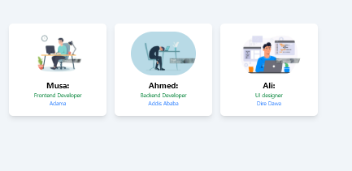

# Profile Cards

A modern and responsive profile card built with **React**, **Vite**, and **Tailwind CSS**. This project demonstrates component-based development, reusable UI, and responsive design principles.

## 🚀 Features

- Responsive profile card layout
- Reusable React components
- Clean and modern UI
- Built with Vite for fast development
- Styled using Tailwind CSS

## 🛠️ Technologies Used

- React
- Vite
- Tailwind CSS
- JavaScript (ES6+)

## 📂 Project Structure

```text
Profile Cards/
├── public/
├── src/
│   ├── assets/
│   ├── App.jsx
│   ├── main.jsx
│   └── ...
├── package.json
├── vite.config.js
└── README.md
## 📸 Overview
## 📸 Overview




## 📸 Overview


